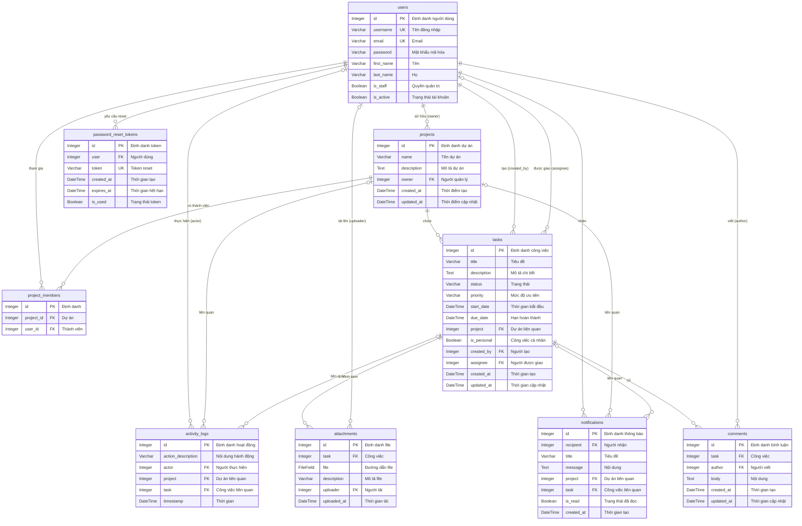

# 4.3. Biểu đồ mối quan hệ thực thể (ERD)

```mermaid
erDiagram
    users {
        Integer id PK "Định danh người dùng"
        Varchar username UK "Tên đăng nhập"
        Varchar email UK "Email"
        Varchar password "Mật khẩu mã hóa"
        Varchar first_name "Tên"
        Varchar last_name "Họ"
        Boolean is_staff "Quyền quản trị"
        Boolean is_active "Trạng thái tài khoản"
    }

    projects {
        Integer id PK "Định danh dự án"
        Varchar name "Tên dự án"
        Text description "Mô tả dự án"
        Integer owner FK "Người quản lý"
        DateTime created_at "Thời điểm tạo"
        DateTime updated_at "Thời điểm cập nhật"
    }

    project_members {
        Integer id PK "Định danh"
        Integer project_id FK "Dự án"
        Integer user_id FK "Thành viên"
    }

    tasks {
        Integer id PK "Định danh công việc"
        Varchar title "Tiêu đề"
        Text description "Mô tả chi tiết"
        Varchar status "Trạng thái"
        Varchar priority "Mức độ ưu tiên"
        DateTime start_date "Thời gian bắt đầu"
        DateTime due_date "Hạn hoàn thành"
        Integer project FK "Dự án liên quan"
        Boolean is_personal "Công việc cá nhân"
        Integer created_by FK "Người tạo"
        Integer assignee FK "Người được giao"
        DateTime created_at "Thời gian tạo"
        DateTime updated_at "Thời gian cập nhật"
    }

    comments {
        Integer id PK "Định danh bình luận"
        Integer task FK "Công việc"
        Integer author FK "Người viết"
        Text body "Nội dung"
        DateTime created_at "Thời gian tạo"
        DateTime updated_at "Thời gian cập nhật"
    }

    attachments {
        Integer id PK "Định danh file"
        Integer task FK "Công việc"
        FileField file "Đường dẫn file"
        Varchar description "Mô tả file"
        Integer uploader FK "Người tải"
        DateTime uploaded_at "Thời gian tải"
    }

    notifications {
        Integer id PK "Định danh thông báo"
        Integer recipient FK "Người nhận"
        Varchar title "Tiêu đề"
        Text message "Nội dung"
        Integer project FK "Dự án liên quan"
        Integer task FK "Công việc liên quan"
        Boolean is_read "Trạng thái đã đọc"
        DateTime created_at "Thời gian tạo"
    }

    activity_logs {
        Integer id PK "Định danh hoạt động"
        Varchar action_description "Nội dung hành động"
        Integer actor FK "Người thực hiện"
        Integer project FK "Dự án liên quan"
        Integer task FK "Công việc liên quan"
        DateTime timestamp "Thời gian"
    }

    password_reset_tokens {
        Integer id PK "Định danh token"
        Integer user FK "Người dùng"
        Varchar token UK "Token reset"
        DateTime created_at "Thời gian tạo"
        DateTime expires_at "Thời gian hết hạn"
        Boolean is_used "Trạng thái token"
    }

    %% ===== QUAN HỆ =====

    %% User - Project: Một người dùng sở hữu nhiều dự án
    users ||--o{ projects : "sở hữu (owner)"

    %% User - Project (M:N): Nhiều người dùng tham gia nhiều dự án
    users ||--o{ project_members : "tham gia"
    projects ||--o{ project_members : "có thành viên"

    %% Project - Task: Một dự án có nhiều công việc
    projects ||--o{ tasks : "chứa"

    %% User - Task: Người tạo và người được giao
    users ||--o{ tasks : "tạo (created_by)"
    users |o--o{ tasks : "được giao (assignee)"

    %% Task - Comment: Một công việc có nhiều bình luận
    tasks ||--o{ comments : "có"
    users ||--o{ comments : "viết (author)"

    %% Task - Attachment: Một công việc có nhiều tệp đính kèm
    tasks ||--o{ attachments : "đính kèm"
    users |o--o{ attachments : "tải lên (uploader)"

    %% User - Notification
    users ||--o{ notifications : "nhận"
    projects |o--o{ notifications : "liên quan"
    tasks |o--o{ notifications : "liên quan"

    %% Activity Log
    users |o--o{ activity_logs : "thực hiện (actor)"
    projects |o--o{ activity_logs : "liên quan"
    tasks |o--o{ activity_logs : "liên quan"

    %% Password Reset Token
    users ||--o{ password_reset_tokens : "yêu cầu reset"
```
